# EVSE Pro User Manual

> Applies to: EVSE Pro v1.0.0 (2026-07-16 mainline) · Language: English
> This is a **feature-oriented** manual: it explains *how to use* the app. For troubleshooting ("something went wrong"), see the in-app Help center (Me → Help center); each chapter ends with a pointer to the relevant section.
> Derived from the Chinese authoritative source `EVSEPro-使用功能说明书.md`. All quoted text matches the app's English language pack verbatim.

---

## About this manual {#preface}

### Audience and scope

| Document | Answers | Location |
|---|---|---|
| **This manual** | What each feature is, how to use it, what it requires | docs/user-manual/ |
| Help center | How to troubleshoot problems | In app: Me → Help center |
| Sales handbook | Why choose EVSE Pro | docs/sales/ (internal) |

### Legend: operation prerequisites

Whether an operation is available depends on four independent dimensions. This manual marks every operation with unified badges; no badge means no restriction:

| Badge | Meaning |
|---|---|
| 🔵 **Nearby only** | Requires standing next to the charger — executed over Bluetooth (nearby); attempting remotely shows "Move closer and try again" |
| ☁️ **Works remotely** | Works over both Bluetooth (nearby) and Cloud (remote) |
| 🔑 **Sign-in required** | Requires an account (tapping while signed out opens sign-in first) |
| 👤 **Owner only** | Visible/usable only to the device owner; shared users don't see this entry |
| 🔧 **Model-specific** | Only shown for devices with the matching capability (screen, load balancing, connectivity, …) |

### Terminology

- **Bluetooth (nearby)**: direct connection when your phone is close to the charger. **Cloud (remote)**: relayed through the charger's home Wi-Fi when you're away. These are the app's two control channels; switching is fully automatic.
- **Online**: the device is online if *either* channel is reachable — if you're next to the charger and Bluetooth can connect, it shows "Online" even without internet.
- **Owner**: the account that paired and claimed the device. **Shared user**: an account granted access through device sharing.
- Text in quotes is the app's actual on-screen wording.

---

## 1 Getting to know EVSE Pro {#overview}

### 1.1 Main interface: three bottom tabs

| Tab | Contents |
|---|---|
| **Home** | Grid overview of all devices; add devices; enter device control; bell icon opens the message center |
| **Scenes** | Charging automation (a preview in this release, see §3.4) |
| **Me** | Account, electricity rate, vehicle efficiency, device sharing, language, appearance, help center, feedback, about |

### 1.2 Device page: four tabs

Tap a charger card on Home to open its device page (full-screen; "‹" top-left collapses back to Home):

| Tab | Contents | Who sees it |
|---|---|---|
| **Status** | Live control (default) · per-phase detail · energy & load balancing 🔧 | Everyone |
| **Schedule** | Scheduled charging (one-time / recurring) | 👤 Owner only |
| **History** | Charging sessions, charts, export | Everyone |
| **Settings** | Device configuration, firmware update, unpairing | Everyone (contents narrowed by role) |

> Shared users get a trimmed 3-tab device page (no "Schedule"), and a reduced Settings page — see §9.3.

### 1.3 Two control channels

- Next to the charger: Bluetooth (nearby) — pairing, control and firmware updates work without home internet.
- Away from the charger: Cloud (remote), if the device has Wi-Fi configured and is bound to your account.
- If your phone's Bluetooth is off, the app switches to Cloud (remote) automatically.
- A few operations are Bluetooth-only (screen brightness, temperature unit, start method, load-balancing configuration, firmware update, unpairing) — marked 🔵 throughout.

---

## 2 Quick start {#quickstart}

### 2.1 First-launch onboarding

The first launch shows a 4-page feature intro (device overview → start/stop & power monitoring → time-of-use charging schedule → Bluetooth direct + remote control). "Skip" anytime; tap "Enter App" on the final page. It only appears automatically once.

### 2.2 Account (can wait)

**Works without signing in**: adding devices, nearby control, charging history and electricity rates all work signed out. Signing in unlocks: cloud remote control, device sharing, message center, feedback. Registration: see §12.1. Signing in before the Wi-Fi step is recommended (the app prompts automatically when needed).

### 2.3 Add a charger (about 2 minutes)

On Home tap "Add a device" (empty state) or "+" (top-right):

1. **Choose a method** — "Pair via Bluetooth" (recommended) or "Scan QR code". The page also explains the Bluetooth / camera / notification permissions.
2. **(Optional) Scan QR code** — the sticker is usually on the right side of the charger near the cable gland; if it won't scan, enter the device ID manually or just use Bluetooth pairing.
3. **Looking for devices** 🔵 — "Make sure your device is powered on and in pairing mode (hold the button for 3 seconds)." Pick your charger from the live list.
4. **Connect to WiFi** 🔑 (connected models only) — enter your home Wi-Fi name and password, tap "Connect". Note: **"This device only supports 2.4 GHz Wi-Fi networks."** A warning appears for names that look like 5 GHz networks. You can also "Skip — use Bluetooth only" (reconfigure later in device Settings → WiFi).
5. **Name the device** — pre-filled with the Bluetooth broadcast name; pick a suggestion ("Garage", "Driveway", …) or type your own.
6. **All set** — shows the device summary; if signed in with Wi-Fi configured, an activation line runs "Your charger is coming online…" → "Your charger is online". Tap "Open <device name>" to jump straight in, or "Add another device".

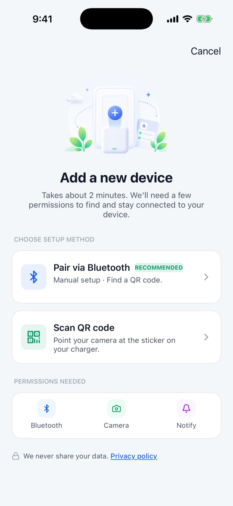   Choose a method · Looking for devices (real device) · All set (real device)

> If pairing reports the charger "is already paired to an owner" or asks you to forget an old pairing in iOS Settings, a previous binding is still on the charger — see Help center "Pairing & Binding".

### 2.4 First charge

Device page → Status tab → "Now" segment:

1. Plug the cable into the charger (screen goes from "NO CABLE CONNECTED" to "READY").
2. Optionally drag the "Current limit" slider.
3. Tap "Start charging". While charging, tap or slide "Stop charging" anytime.

---

## 3 Home & multiple devices {#home}

### 3.1 Device grid

The header shows "My devices" with online/offline counts. Each card: device name (your custom name first) and location/model subtitle; status pill ("Online" green / "Offline" gray / "Shared" blue); channel icons (Bluetooth always, cloud icon = remote-controllable); the model's product render.

If you're next to the device and Bluetooth can connect, the card shows "Online" regardless of internet.

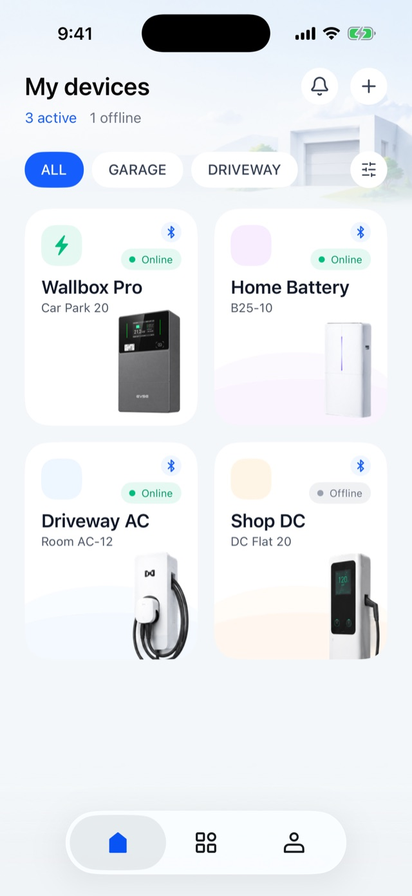 Home · device grid

> In this release only **charger** cards open a control page; home-battery and other types are placeholders.

### 3.2 What happens when you tap a card

- Regular device → opens the device page;
- New phone without local pairing credentials → the app recovers nearby control automatically, falling back to Cloud (remote) when away;
- Device never activated online and no local credentials → "Device not online yet — This charger hasn't come online yet. Finish Wi-Fi setup and wait for it to activate, then you can control it remotely."

### 3.3 Tabs & groups

The Home filter row filters devices by custom tags. Tap the gear on the right of the filter row for "Tabs & groups": toggle a tab's visibility, reorder by long-press drag or the "···" menu, swipe left to delete; "All" is always first and not editable. "Create tab": name up to 6 characters + 5 icon styles + optional device assignment.

> Devices shared *to* you don't participate in custom groups; they appear under "All" only.

### 3.4 The "Scenes" tab (preview)

The second bottom tab "Scenes" currently shows an intro — "Automate your charging" — and "Create scene" responds with "Coming soon". The feature ships in a later release.

---

## 4 Everyday charging control {#charging}

Device page → Status tab → "Now" segment. The screen follows the charger's real state:

### 4.1 The seven states

| State title | When | Available actions |
|---|---|---|
| "NO CABLE CONNECTED" | Idle, no cable | None (plug-in prompt) |
| "READY" | Cable in, vehicle detected | Current limit · "Start charging" ☁️ |
| Charging | Charging in progress | Current limit · "Stop charging" (tap or slide) ☁️ |
| "WAITING" | Scheduled, before start time | "Stop charging" (cancel this wait) ☁️ |
| "Charging paused by the charger" | Charger-side protection or schedule pause | "Resume" ☁️ |
| "VEHICLE PAUSED" | The vehicle requested the stop (usually reached its own target) | "Stop charging" to end the session ☁️ |
| "COMPLETE" | Session finished normally | "Charge Again" ☁️ |

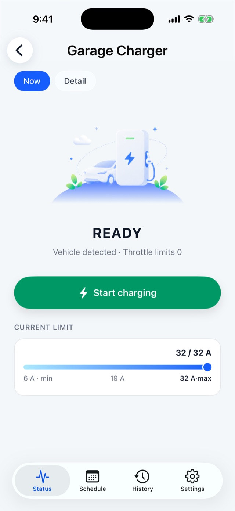 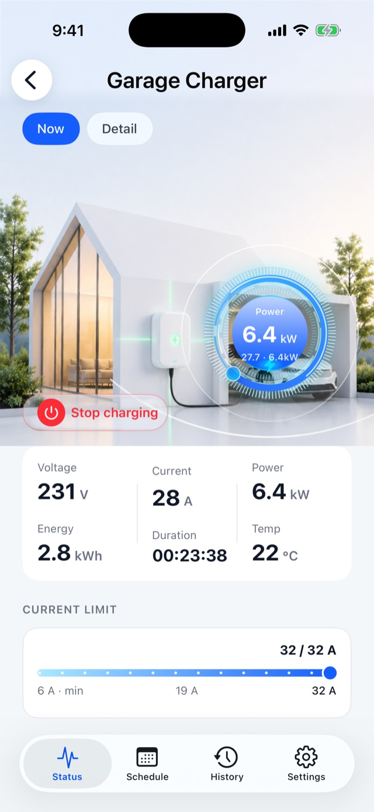 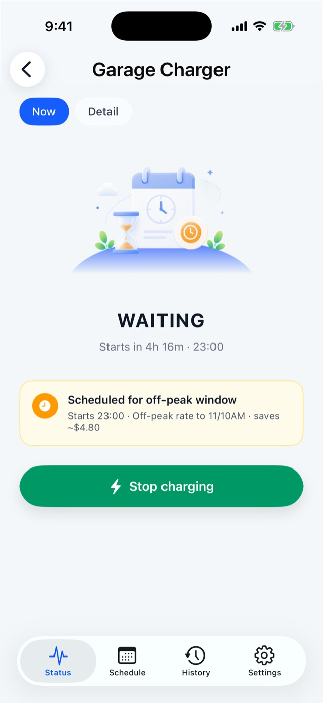 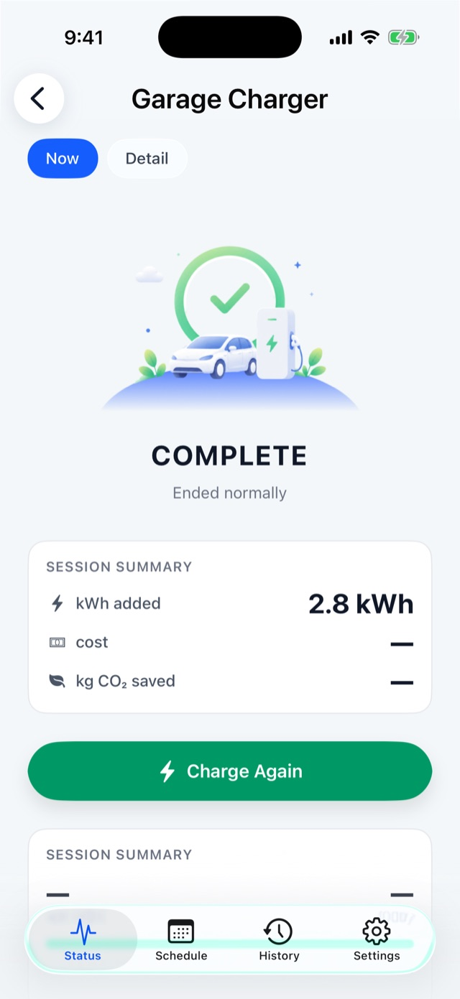 READY · Charging · WAITING · COMPLETE

### 4.2 While charging

- Central power gauge shows current power against rated power;
- Six live metrics: Voltage / Current / Power / Energy / Duration / Temp ("—" when unavailable);
- Duration counts **net charging time** — pauses don't count;

### 4.3 Current limit

In "READY" and while charging, drag the "Current limit" slider (min 6 A, max = the model's rated current); releasing sends the command. If the device rejects it, the slider springs back and explains why.

### 4.4 The "COMPLETE" screen

Session summary: energy delivered, cost (estimated from your rate plan), CO₂ avoided, start/end times and total duration; solar models 🔧 also show a solar/grid source breakdown.

### 4.5 Connection overlays

When the device isn't reachable, an overlay covers the metrics:

<b>Show overlay reference</b>

| Overlay | Meaning / action |
|---|---|
| "Connecting…" | Establishing the link or waiting for first data — just wait |
| "Device offline" | Neither channel reachable, auto-retrying; "Retry" / "Stop retrying". If your phone's Bluetooth is off you'll be prompted to enable it |
| Wrong charger connected | "Search again" to find the right one |
| "Connection failed" | Tap "Retry" |

### 4.6 Rejected or unconfirmed commands

<b>Show prompt reference</b>

- "Plug in the connector or make sure the vehicle is ready, then try again." — vehicle not ready;
- "The charger is offline right now, so it can't run this command." — check power and home network;
- "Couldn't reach the charger over Bluetooth. Move closer and try again." — Bluetooth-only operation or Bluetooth temporarily unreachable;
- "We couldn't confirm whether the command went through. Please try again." — **not a failure**; just a confirmation timeout. The screen updates once the device responds;
- "Access credentials outdated" / "Access removed" — see §9.4;
- Device unpaired (factory reset / unbound elsewhere) — follow the "Remove device" prompt, then pair again.

---

## 5 Scheduled charging {#schedule}

Device page → "Schedule" tab. 🔑 👤 ☁️ (tab is owner-only; the command itself works over either channel)

### 5.1 Two modes (mutually exclusive)

The charger has a single schedule slot: enabling "One-time" disables "Recurring" and vice versa.

| Mode | You set | Behavior |
|---|---|---|
| **One-time** | A specific future date + time | Starts one charge at that moment |
| **Recurring** | Weekdays (multi-select) + one shared start time | Starts automatically on each selected day |

### 5.2 How to use

1. Set the time in the segment (once the switch is on, editing locks — turn it off to change);
2. Turn on "Enable schedule" / "Recurring schedule" — this is when the plan is sent to the charger;
3. Success shows "Schedule set"; rejections roll the switch back with a reason ("Start time has passed — please pick a time in the future", "Select at least one day").

### 5.3 Notes

- The start is driven by **the charger's own clock** — it fires even with the app closed or your phone away;
- A schedule controls only the start; the end comes from the vehicle or a manual stop;
- Recurring mode shares one start time across all selected days;
- Before the start time the device shows "WAITING"; "Stop charging" cancels that wait.

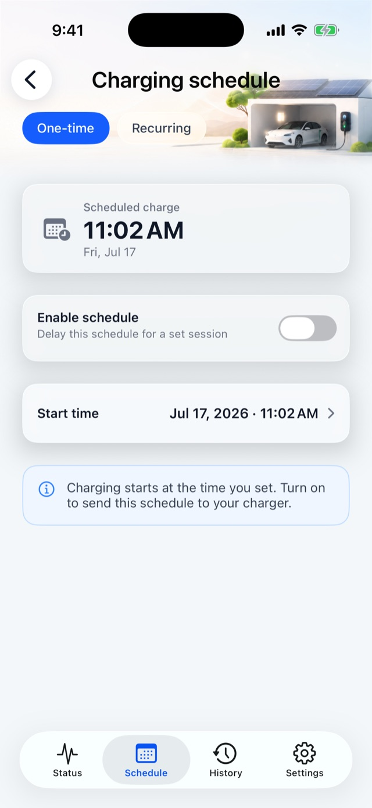 Schedule tab · One-time

---

## 6 Electricity rates & cost {#rateplan}

Entry: "Me → Electricity rate / Vehicle efficiency", or the setup cards on the device History page.

**Global local configuration**: no sign-in, no internet, shared across all chargers.

### 6.1 Rate plan

Per day type (Weekdays / Saturday / Sunday), define multiple time-of-use tiers:

<b>Show editing & validation details</b>

- Each tier = name + price + color + one or more time windows;
- A live overview card shows tier prices, a 24-hour price curve and window summaries;
- "Add tier" creates; tapping a tier opens the editor ("Delete tier" available);
- Saturday/Sunday can "Import from weekdays"; "Clear all tiers" empties the current day type (both confirm first);
- Time windows **must not overlap** — validation highlights conflicts in red and blocks saving;
- The currency symbol follows the system language and region.

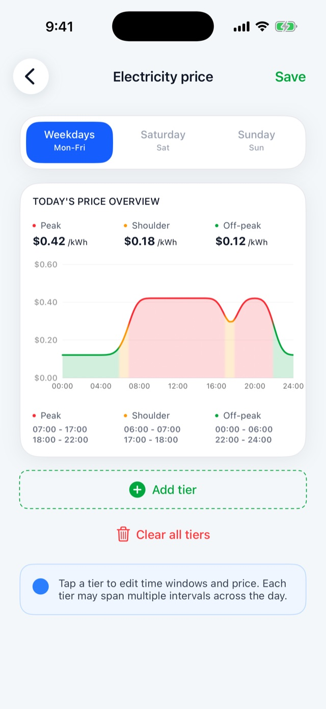 Rate plan editor

Once set, History and the "COMPLETE" screen show per-session cost estimates; costs already recorded are never recalculated after a price change.

### 6.2 Vehicle efficiency

Set your vehicle's consumption (8–25 kWh/100km slider, default 17) to convert energy into estimated range and CO₂ comparisons. **Range and CO₂ figures are estimates.**

---

## 7 Charging history {#history}

Device page → "History" tab. Data lives on this phone — viewable while the device is offline; owners and shared users alike, no sign-in.

### 7.1 History home

- **Latest charge** stats: energy / range / CO₂ trio + today/this-month summaries (before the first charge: "Charging fee" and "Charging range" setup cards instead);
- **Chart**: weekly / monthly / yearly energy bars;
- **Recent sessions**: latest 3, tap for detail;
- "Share" renders the page as an image; "Export full history (CSV)" for bulk export.

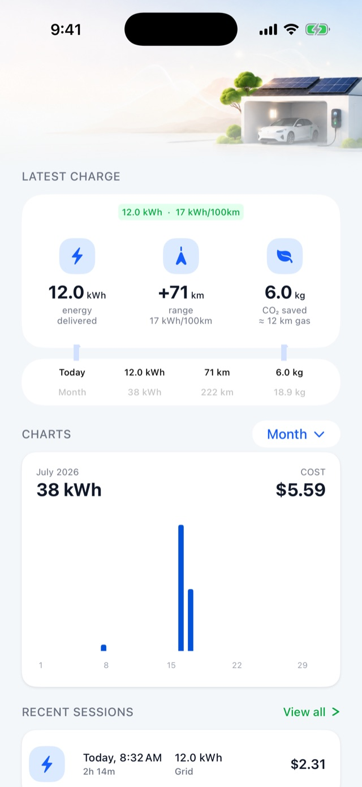 History tab

### 7.2 All sessions

"View all" opens the full month-grouped list: group headers summarize count · kWh · cost; the calendar icon filters by presets ("Last 7 days", "Last 30 days", "This year", …) or a custom range; "Export All Sessions (CSV)" at the bottom.

### 7.3 Session detail

Everything about one session: status (Completed / Charging / Stopped), energy, cost, "Saved vs peak", start method, stop reason, peak temperature, CO₂; solar models add a solar/grid split. "Download receipt (PDF)" generates a single-session receipt; "Share" renders the page as an image.

> Missing data shows "—" — never a fabricated 0. Stop-reason labels are explained in Help center "Stop-Reason Reference".

---

## 8 Energy & load balancing {#energy}

Device page → Status tab → "Energy" segment. 🔧 Only on models with dynamic load balancing (DLB).

### 8.1 Live energy flow (read-only, visible to everyone)

Animated flow between solar / grid / home / charger nodes. The charger node shows live power; grid and solar current readings require a CT clamp and load balancing enabled — otherwise "—".

### 8.2 Load balancing configuration 👤 🔵 (owner only, Bluetooth-only)

<b>Show configuration details</b>

- "Dynamic load balancing" master switch;
- "Mode": Standard / Pure solar / Grid restriction / Hybrid (the latter two on solar models 🔧 only);
- With DLB on, three sliders appear: **Max into house** (6–100 A), **Grid limit** (0–100 A, 0 = unlimited), **Min charging current** (from 6 A);
- "Charging current" shows the live value plus the active constraint ("Limited by household load", "Tracking solar surplus", "At configured limit", …).

Away from the charger these controls fail immediately with "Couldn't reach the charger over Bluetooth. Move closer and try again."

---

## 9 Device sharing {#sharing}

Share a charger with family; everyone controls it from their own phone. Two ways:

| Method | Works for | Validity | Revocation |
|---|---|---|---|
| **Online share** | Cloud-bound (connected) chargers | 7 / 30 / 90 days | Owner revokes anytime in share management |
| **Nearby share code** | Any charger (incl. offline-only) | 1 h / 24 h / 7 days / 30 days | Expires automatically; recipient can remove it locally |

### 9.1 Owner: initiating 🔑 👤

Entry: device page → Settings → "Share with others".

**Online share**: the recipient opens "Me → Device sharing" to show their invite code → you tap "Scan invite code" → pick a validity → done ("Charger shared"). Up to 10 active online shares per device; "Revoke" any member from the list.

 Share management · members (real device)

**Nearby share code** 🔵: next to the charger with Bluetooth connected, tap "Nearby share code" → pick a validity → a QR code is generated for the recipient to scan or paste. It never touches the cloud, doesn't appear in the member list and can't be revoked individually.

> "A share code is a key: anyone holding it can control the charger nearby. Guard it like a physical key."

### 9.2 Recipient: accepting

- Online share: sign in, open "Me → Device sharing", show your invite code to the owner — the device then appears on your Home;
- Nearby share code: on the same page tap "Import nearby share code", scan or "Paste share code" — "Share imported — find it on Home".

### 9.3 What shared users can do

| Feature | Shared user |
|---|---|
| Start / stop charging, current limit | ✅ |
| Live status, per-phase detail, energy flow | ✅ |
| Charging history, export | ✅ |
| "About this charger" | ✅ |
| "Nearby connection" (manual Bluetooth connect, online shares) | ✅ |
| "Remove this shared device" (this phone only) | ✅ |
| Scheduled charging (Schedule tab) | ❌ tab hidden |
| Load balancing, screen brightness, start method, Wi-Fi setup | ❌ |
| Firmware update, sharing onward, unpairing | ❌ |

Shared devices carry a blue "Shared" pill on Home; devices imported via nearby share code don't show live online status (they bypass the cloud).

### 9.4 When access changes

<b>Show details</b>

- **"Access removed"**: the share was revoked or expired; confirming exits the device page. Ask the owner to share again.
- **"Access credentials outdated"**: the device's binding changed (e.g. the owner revoked another share); tap "Refresh credentials" — "Credentials updated — please retry". Owners and shared users can both encounter this.

---

## 10 Message center {#messages}

Entry: bell icon top-right on Home (red dot = unread). 🔑 Sign-in required.

- Aggregates notifications from **all** chargers on the account: charging events, alarms, authorization, firmware;
- Card color = category: green = charging, red = critical alarm, amber = warning/authorization, blue = firmware, gray = other; recovery arrives with a "Resolved:" prefix;
- Tap to mark one read; "Mark all read"; "ALL / YESTERDAY / OLDER" time filter; pull to refresh fetches cloud-buffered messages;
- The "Push notifications" banner enables system push in one tap.

 Message center (real device)

> Messages can't be deleted, and tapping one doesn't navigate to the device. The 10 alarm types are explained in Help center "Alarms".

---

## 11 Device settings & maintenance {#settings}

Device page → "Settings" tab. The header card shows the device name, online status and serial number.

### 11.1 Settings at a glance (owner view)

| Item | Requires | Notes |
|---|---|---|
| Header card (rename) | — | Reuses the naming page with suggestions |
| Channel preference | 🔧 | "Auto / Local only (BLE) / Cloud only" — "Applies next time you open this device" |
| WiFi | 🔑 🔵 | Reconfigure / change home Wi-Fi; shows the new SSID on success |
| Share with others | 🔑 👤 | Opens share management (§9) |
| Max current | read-only | Model specification |
| LCD brightness + Auto-adjust | 🔵 🔧 | Screen models only; live preview while dragging |
| Temperature unit ℃/℉ | 🔵 | Also drives the app's temperature display for this device |
| Plug & Charge | 🔵 | On: charging starts on plug-in; off: reveals "How to start charging" |
| How to start charging | 🔵 👤 | Currently offers "Button start" (single press, no verification) |
| Version (firmware update) | 🔑 👤 🔧 🔵 | Green "Update" badge when available (§11.3) |
| About this charger | — | §11.2 |
| Unpair this device | 👤 🔵 | §11.4 |

> Screen brightness, temperature unit and start method are Bluetooth-only; remote attempts get "Move closer and try again".

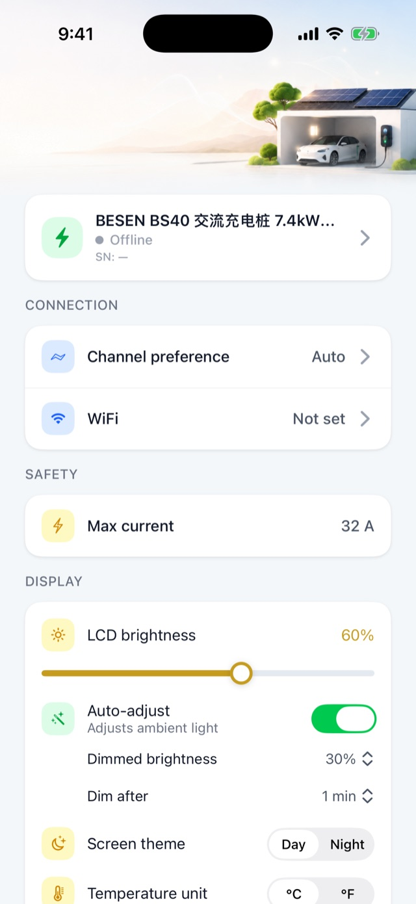 Device settings (owner view)

### 11.2 About this charger

Read-only: product render, model, brand, serial number (**double-tap to copy**), max power, max current, phases, current firmware version. Owners and shared users alike.

### 11.3 Firmware update 🔑 👤 🔧 🔵

Entry: Settings → "Version". **Stay on the page with Bluetooth connected throughout.**

Flow: check → "current X → Y • N MB" → "Update now" → "Downloading…" → "Transferring to charger…" → "Installing…" → "Finishing up…" (charger reboots) → "Update complete".

<b>Show update notes</b>

- The app blocks auto-lock and the back gesture during transfer; leaving prompts a confirmation;
- The install-time reboot is normal; the app keeps confirming the new version (up to ~5 min). If told to pull-to-refresh later, revisit the page to verify;
- Failures show a reason (insufficient storage / verification failed / timeout …) with "Retry"; if it keeps failing, power-cycle the charger and retry;
- Without Bluetooth the page shows "Update unavailable — Connect to your charger over Bluetooth to update its firmware."

### 11.4 Unpairing 👤 🔵

Settings bottom → "Unpair this device" → confirm → the app sends the unbind command to the charger and releases the cloud binding → the device leaves Home.

<b>Show what unpairing does</b>

- Unpairing clears this device's charging history, schedules, Wi-Fi name, connection preference, display and start-method settings from the app — a privacy design: after handover, the new owner sees none of your usage;
- It requires reaching the device (Bluetooth preferred); away from the charger it fails with a prompt to retry nearby;
- After repeated failures a "Force remove" escape hatch appears: clears only this phone and the account records — the charger keeps its pairing info (the dialog says so honestly);
- Shared users get "Remove this shared device" instead: local removal only, the owner's share record is unaffected.

> ⚠️ **iOS re-pairing note**: to bind this charger to an iPhone again after unpairing, first open iOS **Settings → Bluetooth**, tap ⓘ next to the charger (named like EVSE-XXXXXX) and choose **Forget This Device**, then pair again in the app. iOS keeps the old Bluetooth pairing after the unbind; without forgetting it, re-pairing keeps failing to connect.

**Switching phones**: unpair on the old phone, then pair on the new one — the cleanest path. If the old phone is gone, sign in on the new phone and open the device card; the app restores control automatically (requires the device to have activated online at least once).

---

## 12 Account & personalization {#account}

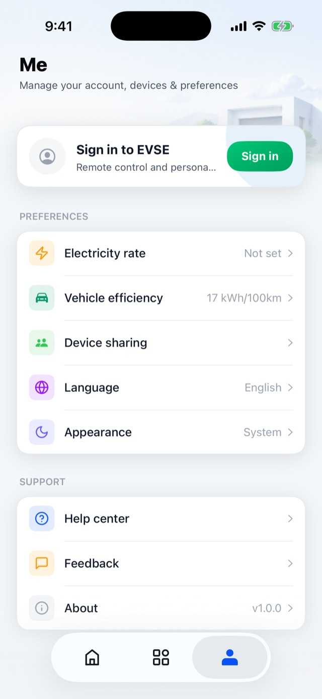 "Me" page

### 12.1 Sign-in & registration

- **Email registration**: name + email + 6-digit email code + password (min 8, strength meter) + Terms of Service and Privacy Policy consent;
- **Email sign-in**: email + password; **Sign in with Apple**: one tap on the sign-in page;
- **Forgot password**: enter the email → "Send reset link" → finish in the email (link valid 30 minutes; check spam). The app has no old-password → new-password form.

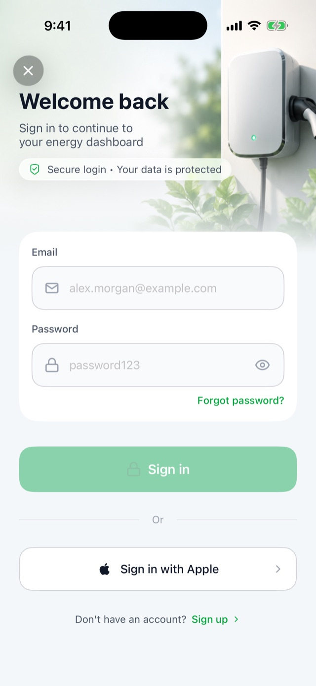 Sign-in

### 12.2 Edit profile ("Me" → avatar card) 🔑

<b>Show profile & account details</b>

- **Nickname** (max 20 chars) and **avatar** (presets / camera / library / reset) — stored on this phone only;
- "Reset password": pre-fills your email, sends the reset link;
- "Sign out": confirm to sign out; sign back in anytime;
- "Delete account": **hold for 1.2 s**. Blocked while devices are still bound ("unbind first"); once confirmed, the account and all charging data are permanently deleted.

### 12.3 Language & appearance

- **Language**: 8 options, instant switch — English, Français, Deutsch, Español, Italiano, עברית, Polski, 简体中文 (Hebrew flips to right-to-left);
- **Appearance**: System / Light / Dark, applied instantly.

### 12.4 About (the app)

"Me → About": app version, "Check for updates" (App Store), "Rate us", "Privacy policy", "Terms of service".

> "Check for updates" checks the **app's** store version — unrelated to charger firmware updates (§11.3).

---

## 13 Getting help {#support}

- **Help center**: "Me → Help center", opens in-app in the app's current language. Covers pairing, connectivity, charging, firmware, account and alarms.
- **Feedback** 🔑: "Me → Feedback". Ticket-based: create with title and description, optionally linked to a charger; the diagnostics toggle (on by default) attaches app version, OS, device model, firmware version etc. (previewable before submitting). Ticket states: Pending / In progress / Resolved / Closed; chat with support inside the ticket.

---

## Appendix A Prerequisites quick reference {#appendix-permissions}

| Operation | Sign-in | Channel | Role | Model |
|---|---|---|---|---|
| Add device (pair & claim) | For Wi-Fi step | 🔵 nearby | becomes owner | — |
| Start / stop / current limit | No | ☁️ both | owner + shared | — |
| Scheduled charging | Yes | ☁️ both | 👤 owner | — |
| History / CSV / PDF receipt | No | local data | owner + shared | — |
| Rates / vehicle efficiency | No | local data | everyone | — |
| Energy flow view | No | ☁️ both | owner + shared | 🔧 DLB models |
| Load balancing config | No | 🔵 nearby | 👤 owner | 🔧 DLB models |
| Brightness / temp unit / start method | No | 🔵 nearby | 👤 owner | brightness needs screen 🔧 |
| Wi-Fi setup / reconfigure | Yes | 🔵 nearby | 👤 owner | 🔧 connected models |
| Channel preference | No | local setting | owner + shared (online) | 🔧 connected models |
| Sharing (create / revoke) | Yes | online via cloud; nearby code 🔵 | 👤 owner | — |
| Import nearby share code | No | local import | — | — |
| Firmware update | Yes | 🔵 nearby | 👤 owner | 🔧 OTA models |
| Unpair device | No | 🔵 nearby | 👤 owner | — |
| Message center / feedback | Yes | cloud | — | — |
| Cloud remote control | Yes | ☁️ cloud | owner + online shares | 🔧 connected models |

## Appendix B States & prompts quick reference {#appendix-states}

**Now-page state flow**: NO CABLE CONNECTED → READY → Charging ⇄ Charging paused by the charger / VEHICLE PAUSED → COMPLETE; with a schedule armed, WAITING.

**Online**: either channel reachable = "Online". When "Offline", check in order: phone Bluetooth on → charger powered → home network up.

**"Couldn't confirm"**: a confirmation timeout, **not a failure** — don't retry repeatedly; the screen updates when the device responds.

**Alarm notifications** (message center; red = critical / amber = warning): Ground fault protection, Output overcurrent, Thermal protection, Charging signal fault, Emergency stop, Grid overvoltage, Grid undervoltage, Connector lock fault, Metering fault, Charger went offline. Details in Help center "Alarms"; recovery arrives as "Resolved:".

---

*Written against the app's actual interface text (English language pack, 2026-07-16). Features subject to the released version.*
